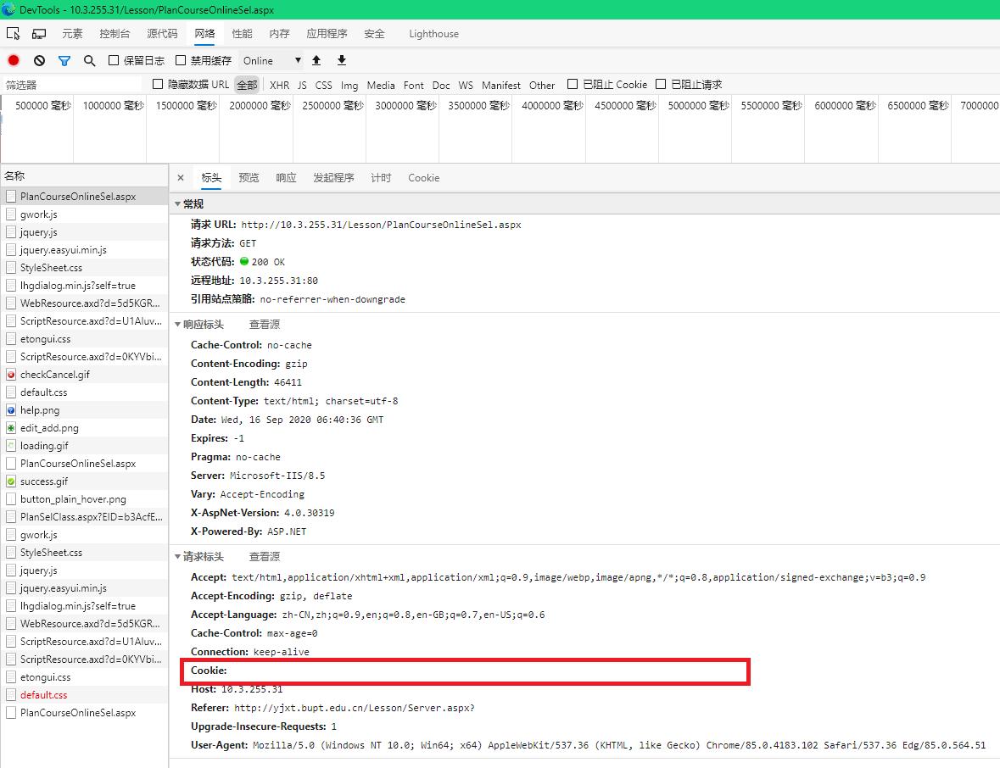
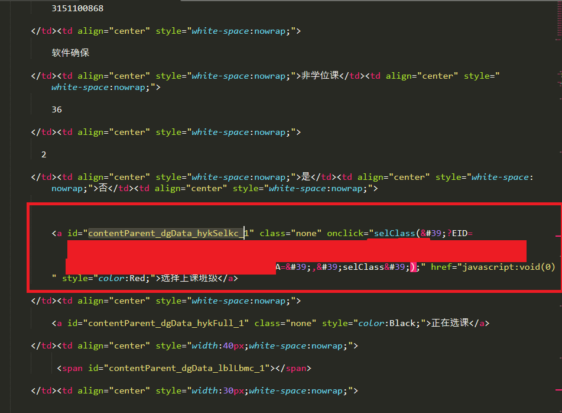
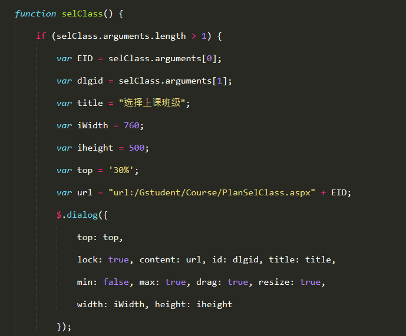
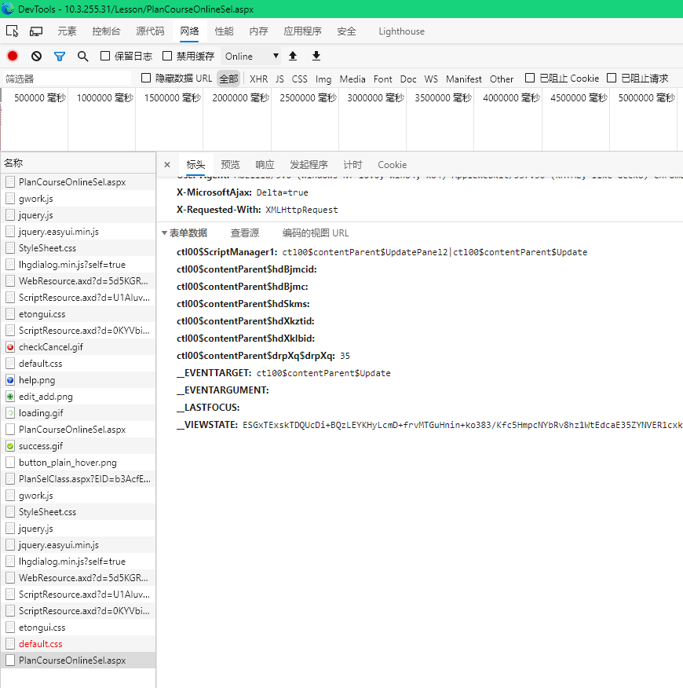

# 2020SelectClassScript
选课脚本

## 运行命令
```shell
python select_class.py
```

## 注意事项
以下内容需要在脚本运行前于config.ini文件中手动设置

1. 选课服务器的ip地址和http抬头：例：```host_url = http://10.3.255.3x```

2. 个人登录的cookie值，如通过浏览器访问选课系统，检查出请求头中的Cookie字段值如下图所示：
   

   则在config.ini中的cookie字段填写为：```cookie = ASP.NET_SessionId=xxxxxxxxxxxxxxxxxxxx; DropDownListYx_xsbh=xxxxxx; DropDownListXqu=```

3. 想选的课程的名称列表，python的列表写法，python文件获取到值后会将字符串转成列表，如desired_class_names=['软件确保']

4. 是否让脚本在控制台中打印所有消息，默认取True。在配置文件中配置为False，脚本将只通知你能否选课成功以及cookie过期消息。

## 制作分析过程

找到选课的元素


选课元素的click函数调用的js函数，访问选课对话框URL


选课对话框提交处理后提交表单


## 其他杂项
1. 在运行脚本前可以在config.ini试一下选容易选的课测试脚本的可用性，如果成功就退掉那个课，让脚本正式地选你想要选的课。
2. 该脚本需要的库有configparser，requests，bs4。
3. 脚本请求之后会休眠5-15秒钟。
